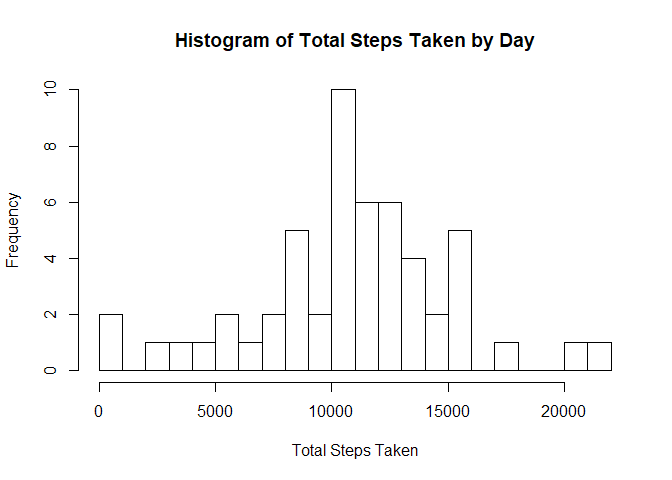

# Reproducible Research: Peer Assessment 1

## Loading and preprocessing the data

```r
filepath <- getwd()
filename <- paste(filepath,"/activity.zip",sep="") 
unzip(filename)
activity <- read.csv("activity.csv")
```

## What is mean total number of steps taken per day?

```r
# set na.rm to FALSE so the sum wouldn't be zero for the day which would skew the results
totalStepsByDay <- aggregate(activity$steps,by=list(Day=as.factor(activity$date)),FUN=sum,na.rm = FALSE)
hist(totalStepsByDay$x,xlab="Total Steps Taken",main = "Histogram of Total Steps Taken by Day", breaks=30)
```

<!-- -->

```r
meanStepsPerDay <- mean(totalStepsByDay$x,na.rm = TRUE)
medianStepsPerDay <- median(totalStepsByDay$x,na.rm = TRUE)
```

Mean steps per day: 1.076619\times 10^{4}  
Median steps per day: 10765  

## What is the average daily activity pattern?

```r
meanStepsByInterval <- aggregate(activity$steps,by=list(Interval=as.factor(activity$interval)),FUN=mean,na.rm = TRUE)
maxStepsByIntervalIdx <- which.max(meanStepsByInterval$x)
maxStepsByInterval <- meanStepsByInterval[maxStepsByIntervalIdx,]
maxVal <- maxStepsByInterval$x
maxIdx <- maxStepsByInterval$Interval
#create line plot
library(ggplot2)
#as.numeric(as.vector(Interval)) below is so you can see the Interval values
ggplot(meanStepsByInterval,aes(x=as.numeric(as.vector(Interval)),y=x,group=1)) +
    labs(x="Interval",y="Steps",title="Average steps per interval") +
    geom_point() +
    geom_line()
```

<!-- -->

The maximum average value by interval is 206.17 at time interval 835.

## Imputing missing values

```r
nacount <- sum(is.na(activity$steps))
#create new dataset with NA values replaced (imputed) my the mean for all days of that 5-minute interval
newactivity <- activity
newactivity$steps <- ifelse(is.na(newactivity$steps), meanStepsByInterval$x[match(newactivity$interval, meanStepsByInterval$Interval)], newactivity$steps)

totalStepsByDayNew <- aggregate(newactivity$steps,by=list(Day=as.factor(newactivity$date)),FUN=sum,na.rm = TRUE)
hist(totalStepsByDayNew$x,xlab="Total Steps Taken",main = "Histogram of Total Steps Taken by Day with Imputed values", breaks=30)
```

<!-- -->

```r
meanStepsPerDayNew <- mean(totalStepsByDayNew$x,na.rm = TRUE)
medianStepsPerDayNew <- median(totalStepsByDayNew$x,na.rm = TRUE)
```

There are 2304 missing values in the dataset.

Mean steps per day with imputed values: 1.0766189\times 10^{4}  
Median steps per day with imputed values: 1.0766189\times 10^{4}  

The mean for the imputed values doesn't change.  The missing values were always entire 
days, so using the average day to replace the missing values just reinforced the overall average.

The median for the imputed values changes a little bit.

At first it worried me that the median and the mean of the imputed dataset were the same, but
after thinking about it, I decided it makes sense.


```r
meanStepsByIntervalnew <- aggregate(newactivity$steps,by=list(Interval=as.factor(newactivity$interval)),FUN=mean,na.rm = TRUE)
maxStepsByIntervalIdxnew <- which.max(meanStepsByIntervalnew$x)
maxStepsByIntervalnew <- meanStepsByIntervalnew[maxStepsByIntervalIdxnew,]
maxValnew <- maxStepsByIntervalnew$x
maxIdxnew <- maxStepsByIntervalnew$Interval

ggplot(meanStepsByIntervalnew,aes(x=as.numeric(as.vector(Interval)),y=x,group=1)) +
    labs(x="Interval",y="Steps",title="Average steps per interval") +
    geom_point() +
    geom_line()
```

<!-- -->


## Are there differences in activity patterns between weekdays and weekends?


```r
weekday <- weekdays(as.Date(as.character(newactivity$date)))
newactivity$weekday <- ifelse(weekday %in% c("Saturday","Sunday"), "weekend","weekday")
newactivity$weekday <- as.factor(newactivity$weekday)

meanStepsByIntervalWeekday <- aggregate(newactivity$steps,by=list(interval=newactivity$interval,weekday=newactivity$weekday),FUN=mean,na.rm = TRUE)

ggplot(data=meanStepsByIntervalWeekday,aes(x=interval,y=x,group=weekday,color=weekday)) +
    labs(x="Interval",
         y="Number of steps",
         title = "Steps over Interval by Weekday vs Weekend") + 
    facet_grid(weekday~.) +
    geom_line()
```

<!-- -->
